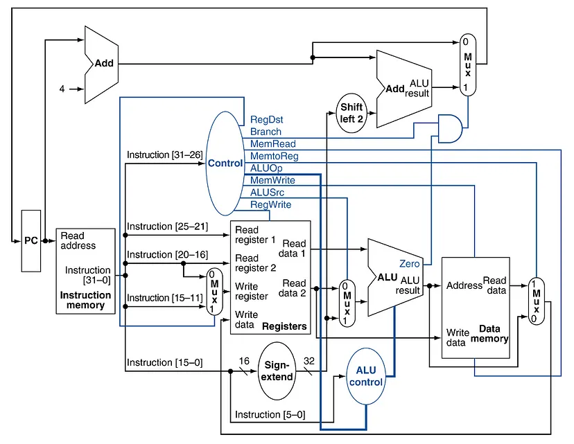

# Single-Cycle RISC-V CPU Implementation

## Overview

This project is a hardware implementation of a single-cycle RISC-V CPU. It supports a subset of the RISC-V instruction set architecture (ISA), including key instructions for arithmetic operations, memory access, and control flow. A single-cycle CPU executes each instruction in one clock cycle. While this makes the design conceptually simple, it can limit performance due to the varying latencies of different instructions.

## Features

* **Supported Instructions:**
    * R-type: `add`, `sub`, `slt`, `or_op`, `and_op`
    * I-type: `addi`, `slti`, `lw`
    * S-type: `sw`
    * B-type: `beq`
    * J-type: `jal`
    * U-type: `lui`
    * Special Instruction: `ctz` (Count Trailing Zeros)
* **Single-Cycle Design:** Each instruction is executed in a single clock cycle.
* **Verilog Implementation:** The CPU is implemented using Verilog HDL.
* **Modular Design:** The CPU is designed with modular components for easy understanding and modification.

## Datapath Architecture

The following image shows the single-cycle datapath of the implemented RISC-V CPU.

<div align="center">

</div>

###   Datapath Components

* **PC (Program Counter):** Stores the address of the current instruction.
* **Instruction Memory:** Stores the RISC-V instructions to be executed.
* **Control Unit:** Generates control signals based on the instruction's opcode.
* **Register File:** Stores the CPU's registers.
* **ALU (Arithmetic Logic Unit):** Performs arithmetic and logical operations.
* **Data Memory:** Stores and retrieves data.
* **Immediate Generator:** Generates the immediate value from the instruction.
* **Muxes:** Select data from different sources.
* **Adder:** Computes the next PC address.
* **Shift Left One:** Performs shift left operation for branch calculation

## Functional Description of Modules

* **ALU:**
    * Performs arithmetic and logic operations as directed by `ALUCtl`.
    * Supports `ADD`, `SUB`, `SLT`, `OR`, `AND`, and `CTZ`.
    * Computes the `zero` flag, indicating if the result is zero.
* **ALUCtrl:**
    * Generates the `ALUCtl` signal based on the instruction's `ALUOp`, `funct7`, and `funct3` fields.
    * Decodes the instruction to determine the specific ALU operation.
* **Control:**
    * Generates all the control signals for the datapath, including `branch`, `memRead`, `memtoReg`, `ALUOp`, `memWrite`, `ALUSrc`, and `regWrite`.
    * The control logic is determined by the instruction's opcode.
* **DataMemory:**
    * Handles memory read and write operations.
    * `memWrite`: When high, data is written to memory at the address specified by the `address` input.
    * `memRead`: When high, data is read from memory at the address specified by the `address` input.
* **ImmGen:**
    * Generates the immediate value used by I-type, S-type, B-type, U-type, and J-type instructions.
    * Extracts and sign-extends the immediate from the instruction bits.
* **InstructionMemory:**
    * Stores the RISC-V instructions.
    * Fetches the instruction at the address specified by the `readAddr` input.
* **Mux2to1:**
    * A 2-to-1 multiplexer.
    * Selects between two input values (`s0` and `s1`) based on the `sel` input.
* **PC:**
    * Stores the address of the current instruction.
    * Updates its value on the rising edge of the clock.
* **Register:**
    * Stores the register values.
    * Reads data from registers `readReg1` and `readReg2`.
    * Writes data to register `writeReg` when `regWrite` is asserted.
* **ShiftLeftOne:**
    * Performs a left shift by one bit.
    * Used in calculating branch target addresses.
* **SingleCycleCPU:**
    * The top-level module that instantiates and connects all the other modules.
    * Implements the complete single-cycle RISC-V CPU datapath and control.
* **Adder:**
         * Performs addition of two 32 bit numbers.
         * Used to calculate next PC and branch target address.

## Trailing Zero Count (CTZ) Instruction

This implementation includes a custom instruction, `ctz` (Count Trailing Zeros). The `ctz` instruction counts the number of consecutive zero bits starting from the least significant bit (LSB) of the input register.
<div align="center">

</div>
###   Verilog Implementation of CTZ in ALU

```verilog
4'b1111: begin : count_loop             // Trailing Zero Count (TZCNT)
    ALUOut = 32'd0;
    for (i = 0; i < 32; i = i + 1) begin
        if (A[i] == 1)
            disable count_loop;         // Stops when 1 is found
        else
            ALUOut = ALUOut + 1;
    end
end

ExplanationALU Control Signal: When the ALUCtl is 4'b1111, the ALU performs the ctz operation.Initialization: The ALUOut register, which will hold the count, is initialized to zero.Loop: The for loop iterates through the bits of the input A, starting from the LSB (bit 0) and going up to the MSB (bit 31).Check for '1':Inside the loop, the current bit A[i] is checked.If A[i] is '1', the disable count_loop statement is executed. This statement immediately terminates the loop. The count is complete.Increment Count:If A[i] is '0', the ALUOut register is incremented, indicating that another trailing zero has been found.Loop Termination:The loop continues until a '1' is encountered or all 32 bits have been checked.Result: ALUOut will contain the number of trailing zeros.Simulation ResultsThe following simulation waveform shows the execution of the ctz instruction.Waveform Explanationclk: The clock signal.start: The reset signal.A[31:0]: The input to the ALU.ALUCtl[3:0]: The ALU control signal.  When it is 4'b1111, the CTZ operation is performed.ALUOut[31:0]: The output of the ALU, which shows the number of trailing zeros.zero: The zero flag.Based on the provided waveform:At 6.040 ns, ALUCtl is '0', and A is  00000000.At 8.040 ns, ALUCtl is '0', and A is  00000000.At 16.040 ns, ALUCtl is '0', and A is 00000010. The ALUOut is 00000001, showing one trailing zero.At 24.040 ns, ALUCtl is '0', and A is 00000020. The ALUOut is 00000005, showing five trailing zeros.How to UseClone the repository:git clone <your_github_repository_url>
cd <your_github_repository_name>
Open the Verilog files: Open the Verilog files in the rtl directory using a Verilog HDL editor (e.g., Vivado, ModelSim).Simulate the design: Run the SingleCycleCPU_tb.v testbench to simulate the CPU.Synthesize the design (Optional): Synthesize the design for a specific FPGA target if you want to implement it in hardware.Project Structure├───README.md

